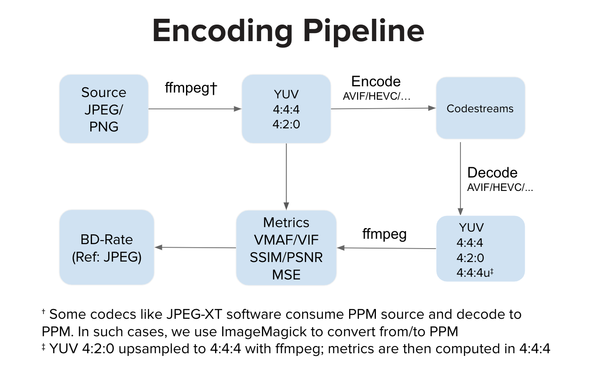

#### Source images:
- Place your source images in `./images`
- Currently, only supporting source images in *JPEG* and *PNG* formats
- Images in one run should have the same size (number of pixels)
- Avoid spaces or other characters requiring escape sequences in source image file names

#### To add another codec:
- Update the `Dockerfile` to include your binaries
- Add code to encode, decode and compute metric in method `f()`
- Add your codec to `TUPLE_CODECS`

#### To build container:
> - `docker build -t image_compression_comparison .`

#### To run container:
> - `docker run -it -v $(pwd):/image_compression_comparison image_compression_comparison`

#### Run script:
> - `python3 script_compress_parallel.py`

Encodes targeting certain metric values are performed and results stored in respective database files, for example:
> - `main(metric='ssim', target_arr=[0.92, 0.95, 0.97, 0.99], target_tol=0.005, db_file_name='encoding_results_ssim.db')`
> - `main(metric='vmaf', target_arr=[75, 80, 85, 90, 95], target_tol=0.5, db_file_name='encoding_results_vmaf.db')`

#### Logs:
- In file `compression_results_[PID]_[TIMESTAMP].txt`
- And files `compression_results_worker_[PID]_[TIMESTAMP].txt`

#### Results:
In sqlite3 database files, for example `encoding_results_vmaf.db` and `encoding_results_ssim.db`.

Percentage BD rates can be computed using a script called `compute_BD_rates.py`. The script takes one argument:
> - `python3 compute_BD_rates.py [db file name]`

and prints values for `BD Rate VMAF`, `BD Rate SSIM`, `BDRate MS_SSIM`, `BDRate VIF`, `BDRate PSNR_Y` and `BDRate PSNR_AVG` for every source image as well as the mean over the source dataset. BD rates are printed for both `420` as well as `444` subsampling. `PSNR_AVG` is derived from `MSE_AVG` which is weighted MSE across all color components, weighted according to number of samples in respective color components.

Also included is a script called `analyze_encoding_results.py` which 
- (a) stores rate-quality graphs in PNG files
- (b) prints average file size reduction (also as percentage) compared to the baseline codec for various target qualities. For example,
    * file size reduction at VMAF=90
    * file size reduction at VMAF=95, etc. 

The script takes two arguments:
> - `python3 analyze_encoding_results.py [metric_name like vmaf OR ssim] [db file name]`

It should be noted that BD rate provides one aggregated number over the entire range of target qualities. 
Looking at BD rate alone, certain insights can be missed, for example, how does compression efficiency compare for say specifically VMAF=95 operating point? 

Another example is, let's say BD rate is zero. It is entirely possible that the rate-quality curves cross over and one codec is significantly better than the other at say VMAF=95 operating point, and worse in the lower bitrate region.

Ideally, when image assets are encoded for using in the UI, one would like to have well-defined operating quality such as VMAF=95. And arguably, results from the lower quality region might be immaterial. The insights described in (b) thus augment the "overall" insight afforded by BD rate.

#### Parallelization:
The number of concurrent worker processes can be specified in
> - `pool = multiprocessing.Pool(processes=4, initializer=initialize_worker)`

Given the system you are running on, reasonable concurrency might be limited by number of processor cores or amount of RAM available versus memory consumed by the most demanding encoder process in the ensemble of codecs being tested. For example, if an encoder_A instance typically consumes 5GB RAM and you have 32GB total RAM then reasonable concurrency might be limited to 6 (32 / 5) even if you have 24 (or anything greater than 6) processor cores.

#### Encoding pipeline:
Ideally, an encoder implementation consumes YUV input and generates a codestream. Ideally, a decoder implementation consumes the codestream and decodes to YUV output. We then compute metrics in YUV space. However, there are implementations like JPEG-XT software that consume PPM input and produce PPM output. In such cases, there might be a source PPM to YUV conversion and also a decoded PPM to YUV conversion before quality computation in YUV space. The extra conversion steps, compared to the regular pipeline, can introduce slight distortion but in our experiments those steps do not make any noticeable dent in the VMAF score.

- Author : Aditya Mavlankar (Encoding Technologies, Netflix, Inc.)
